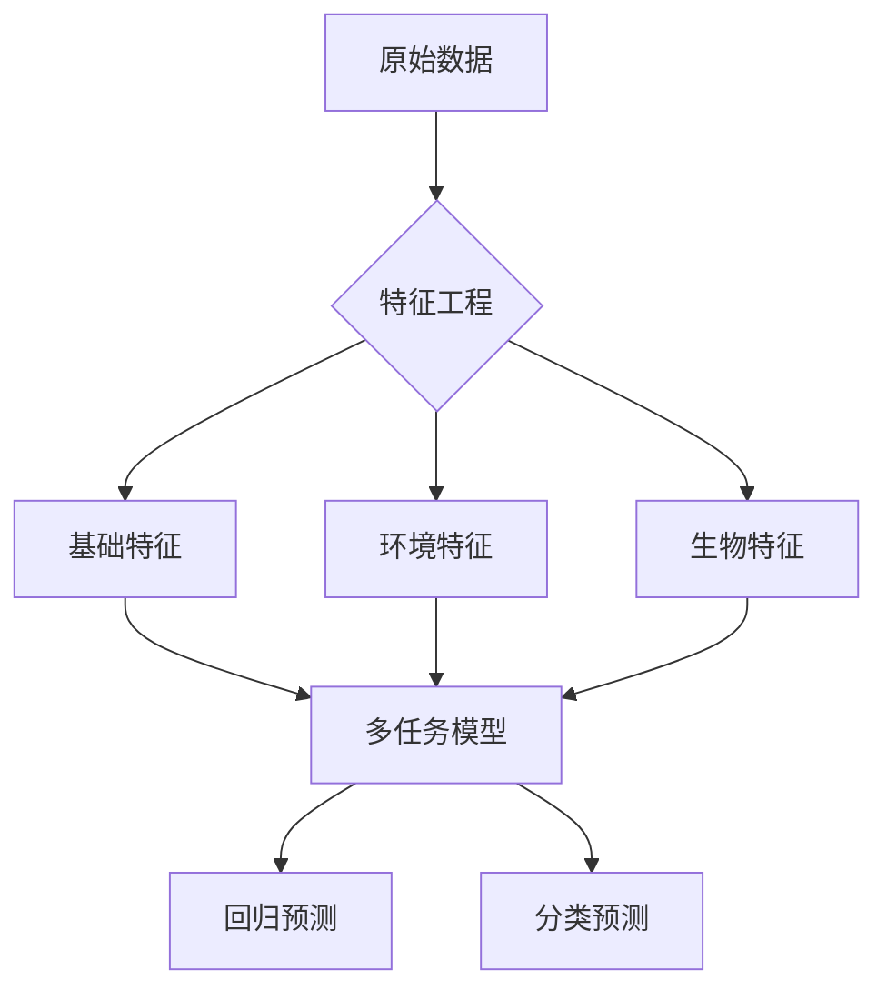

# 犯罪嫌疑人脚印智能分析系统


基于机器学习与生物力学分析的刑侦辅助系统，通过犯罪现场脚印数据预测嫌疑人的生理特征和步态特征。

---

## 目录
- [核心功能](#核心功能)
- [文件结构](#文件结构)
- [快速开始](#快速开始)
- [数据字段说明](#数据字段说明)
- [系统架构](#系统架构)
- [贡献指南](#贡献指南)
- [许可证](#许可证)

---

## 核心功能

| 功能模块         | 能力描述                                                                 |
|------------------|--------------------------------------------------------------------------|
| 多维度生理推断   | 身高预测（MAE≤3cm）、体重预测（MAE≤5kg）                                 |
| 智能环境补偿     | 支持5种地面材质的动态深度修正                                            |
| 步态特征识别     | O型腿/X型腿分类识别（准确率≥85%）                                        |
| 实时分析服务     | RESTful API支持毫秒级响应，并发能力≥50QPS                                |

---

## 文件结构

```plaintext
footprint-analysis/
├── data/                     # 数据存储
│   └── raw/                  # 原始数据（案件采集数据）
│
├── fonts/                    # 数据存储
│   └── MiSansVF.ttf          # 生成可视化数据引用字体
│
├── models/                   # 模型存储
│   ├── footprint_model.h5    # 训练好的Keras模型
│   └── preprocessor.pkl      # 数据预处理管道
│
├── reports/                  # 可视化输出
│   └── model_performance.png # 模型评估可视化
│ 
├── src/                      # 源代码
│   ├── data_preparation.py   # 数据生成与增强
│   ├── model_training.py     # 模型构建与训练
│   ├── evaluation.py         # 模型评估与解释
│   └── app.py                # Flask API服务
│
├── requirements.txt          # Python依赖清单
└── README.md                 # 项目主文档
```

---

## 快速开始

### 环境要求
- Python 3.9+
- TensorFlow 2.12+
- 内存 ≥8GB
- 磁盘空间 ≥1GB

### 安装部署
```bash
# 克隆仓库
git clone https://github.com/hujiayucc/footprint-analysis.git
cd footprint-analysis

# 安装依赖
pip install -r requirements.txt

# 生成示例数据（默认：1000条，最低140，最高200）
python -m src.data_preparation

# 生成示例数据（1000条样本，最低150，最高180）
python -m src.data_preparation --count 1000 --min_height 150 --max_height 180

# 训练模型
python -m src.model_training

# 启动API服务
python -m src.app
```

### API调用
```bash
curl -X POST http://localhost:5000/predict \
     -H "Content-Type: application/json" \
     -d '{
           "foot_length": 25.3,
           "foot_width": 9.8,
           "arch_height": 3.1,
           "depth_diff": 1.7,
           "pressure_offset_x": -2.1,
           "ground_type": "wet_soil",
           "humidity": 70,
           "depth": 5.2,
           "pressure_avg": 85.3
         }'
```

---

## 数据字段说明

### 输入特征（API请求参数）

| 字段名               | 类型   | 单位/取值范围                     | 是否必需 | 说明                                                                 |
|----------------------|--------|-----------------------------------|----------|----------------------------------------------------------------------|
| `foot_length`        | float  | 厘米（20.0-35.0）                | 是       | 脚印长度，从脚跟到脚尖的直线距离                                     |
| `foot_width`         | float  | 厘米（8.0-12.0）                 | 是       | 脚印最宽处的横向宽度                                                 |
| `arch_height`        | float  | 厘米（2.0-4.5）                  | 是       | 足弓最高点与地面的垂直距离                                           |
| `depth_diff`         | float  | 毫米（-5.0 至 +5.0）             | 是       | 脚印内外侧深度差，正值表示外侧更深（O型腿典型特征）                   |
| `pressure_offset_x`  | float  | 毫米（-5.0 至 +5.0）             | 是       | 压力中心横向偏移，正值表示压力偏向外侧（X型腿典型特征）               |
| `ground_type`        | string | `["concrete", "wet_soil", "dry_soil", "sand", "grass"]` | 是 | 地面材质类型 |
| `humidity`           | int    | 百分比（0-100）                  | 是       | 环境湿度                                                             |
| `depth`              | float  | 毫米（0.5-8.0）                  | 是       | 脚印凹陷深度                                                         |
| `pressure_avg`       | float  | 千帕（kPa，70-100）              | 是       | 足底平均压力值                                                       |

---

### 输出结果（API响应字段）

| 字段名            | 类型       | 说明                                                                 |
|-------------------|------------|----------------------------------------------------------------------|
| `height`          | float      | 预测身高（厘米），正常成人范围：150-200cm                            |
| `weight`          | float      | 预测体重（公斤），正常成人范围：40-120kg                             |
| `leg_type_probs`  | list[float]| 腿型概率分布，索引对应：`[正常腿型, O型腿, X型腿]`                   |

### 环境补偿系数
| 地面类型    | 基准深度（mm） | 湿度影响系数              |
|------------|---------------|--------------------------|
| concrete   | 0.5           | 每+10%湿度，深度+0.1mm   |
| wet_soil   | 4.0           | 每+10%湿度，深度+0.3mm   |
| sand       | 3.0           | 每+10%湿度，深度+0.2mm   |

---

## 系统架构



---

## 贡献指南
1. **数据提交规范**
   - 原始数据存放于`data/raw/`目录
   - 新增数据需包含完整元数据描述

2. **模型改进流程**
   ```bash
   # 创建特性分支
   git checkout -b feature/improved-model
   # 提交性能对比报告
   ```

---

## 许可证
本项目采用 MIT 许可证 - 详情请参阅 [LICENSE](LICENSE) 文件